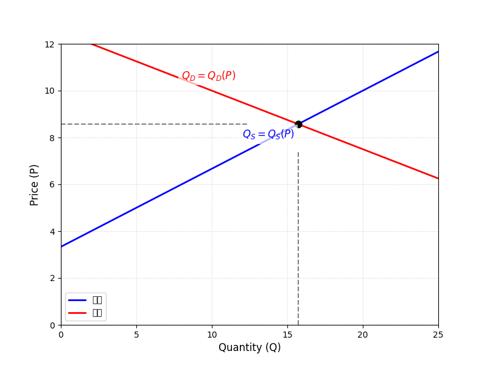

# 微观经济学导论

你手里有100元的生活费，要在食堂解决一天的伙食。是吃一顿丰盛的午餐导致晚餐泡面，还是三餐均衡？这种精打细算，其实已经触及了经济学的核心。同样，一个奶茶店老板决定今天准备多少杯珍珠奶茶，也是在做一个类似的决策。微观经济学的核心就是决策，其重点内容就在于研究经济主体如何在有限资源下，为了获取最大化利益而进行决策。

## 稀缺与理性

为什么我们需要做选择？根本原因在于**资源是稀缺的**（scarcity）。这里的资源不仅指石油、矿产，更指你我口袋里的钱、一天只有24小时的时间，以及工厂的生产线。稀缺性迫使我们必须做出取舍，也就是经济学常说的“权衡”（tradeoff），在损益之间找到权衡是工程学中的重要思想。

> 微观经济学也是关于如何应对有限性的科学。更确切地说，微观经济学是关于如何配置稀缺资源的科学。
>
> 平狄克微观经济学

为了建立合理模型，微观经济学在分析这些取舍时，有一个基本假设：人是**理性的**。这意味着，在做选择时，我们会试图用自己有限的资源，去获得最大的满足（对消费者而言）或最大的利润（对企业而言）。这个假设为我们分析和预测人的行为提供了一个简单的起点。

-   **稀缺性**：社会资源的有限性，这是经济学问题存在的根本前提。
-   **理性选择**：在信息等条件允许下，决策者系统性地追求自身目标（如效用或利润）最大化的行为。

## 如何分析一个市场

掌握了核心概念，我们该如何分析具体问题呢？经济学家最得力的工具就是提出理论，构建**模型**。理论依靠一系列基本原理和假设来解释观察到的现象。模型简单而言可以称为两个或多个经济变量关系的公式模型。

社会科学中的模型不能保证完全正确，但是需要尽可能保证可应用性。

经济模型会聚焦于几个关键变量，忽略次要因素，来揭示复杂现象背后的规律。在分析时，我们通常使用两种不同的视角：

-   **实证分析**：回答“是什么”的问题。它试图客观地描述和解释经济现象。比如，“如果奶茶涨价，销量会下降多少？”这是一个可以通过数据和模型来验证的实证问题。
-   **规范分析**：回答“应该是什么”的问题。它涉及价值判断，主张某种状况比另一种更优。比如，“政府是否应该对奶茶征收糖税以引导健康消费？”这个问题就没有绝对的“对”与“错”，因为它关乎不同人的立场和价值观。

在分析中，我们还会区分两类价格，以便更准确地衡量价值：
-   **名义价格**：就是商品标签上写的价格，比如一杯奶茶15元。
-   **实际价格**：剔除了通货膨胀因素后的价格，反映了商品的真实购买力。比如，考虑了总体物价上涨后，今天的15元奶茶和十年前的10元奶茶，哪个更贵？

## 供需模型的引入

市场模型认为市场是买者和卖者的集合。其中卖者负责供给，买者负责需求。

供需到底多重要呢？1776年亚当斯密《国富论》阐述了经济学思想的早期核心。亚当斯密提出了一个著名悖论：水钻悖论：对水的需求非常巨大，但对钻石的需求并不巨大，然而水的价格却远远低于钻石。其原因就是水的供给远大于钻石的供给。这个例子充分说明了供需二者的统一关系。

供给与需求共同决定了价格的变动，即供给与需求各自是价格的函数。我们将 $Q_S=Q_S(P)$ 视为供给（Supply）的曲线方程，将 $Q_D=Q_D(P)$ 视为需求（Demand）的曲线方程，其中 $P$ 是价格。

如图，图中横坐标为供给/需求量，纵坐标为价格（数字没有意义，并且曲线不一定是直线）。

供给曲线是向上倾斜（递增）的，商品价格越高厂商就会试图扩大生产，或有更多厂商愿意生成出售相关产品。在此过程中，例如成本等因素的变动将会改变曲线的形状或位置。

需求曲线是向下倾斜（递减）的，商品价格越低原先的购买者就有可能购买更多，而更低的价格也可能鼓励以前并没有支付能力的消费者购买。收入水平等因素将会引起需求曲线的变动，典型的，可支配收入在一定范围内的增加将会导致消费量的增加。

此外，相关商品价格变动也会冲击需求曲线，价格增大导致另一种商品需求增加的商品被互称为**替代品**，导致另一种商品需求减少的商品被互称为**互补品**。

供需关系通过市场机制联系起来，为了将其联系在一起，我们进入第二讲。
