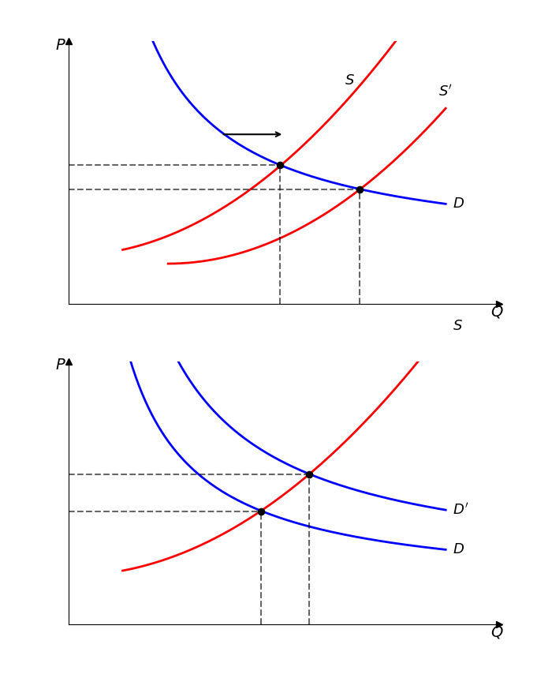

# 微观经济学-消费者理论 I

在导论中，我们了解到经济学是研究人们如何在资源稀缺的条件下做出决策的学问。那么，这些决策具体是如何做出的？本节我们进入基础的市场供求关系，并由此进入消费者理论。

## 市场供求

为了将供求曲线联系在一起，我们引入市场机制。

**需求曲线**

更进一步看需求曲线，需求方每个人心中都有一个愿意支付的最高价格，经济学上称之为**保留价格**。当市场价格低于你的保留价格时就会购买；反之，就会放弃。

把市场上所有消费者的保留价格汇总，我们就得到了**需求曲线**。这条曲线通常向右下方倾斜，需求量与价格之间的反向关系：价格越低，愿意且能够购买的人就越多，总需求量就越大；价格越高，需求量就越小。简单来说，它描绘了消费者在不同价格水平下的购买意愿。

**供给曲线**

供给方根据成本与价格来决定今天进行多少生产。**供给曲线**描绘的就是生产者愿意并能够出售的商品数量与价格之间的关系，因此曲线是向右上方倾斜递增的。

但在一些特殊例子例如大学城租房中，情况会有所变化。短期内，公寓的数量是固定的，比如整个大学城就只有100套公寓可租。无论租金涨到多高，房东也无法立刻变出更多的房子。因此，在这个“短期”内，**供给曲线是一条垂直的直线**，表示供给量固定，不随价格变动。当然，从长期来看，如果租金一直很高，开发商就会建新房，那时供给曲线就会向右移动了。

**市场均衡**

现在，我们把需求和供给两条曲线放在同一个坐标轴里。它们会相交于一点，这个点就是**市场均衡点**。在这一点对应的价格（均衡价格）下，消费者愿意购买的数量正好等于生产者愿意提供的数量（均衡数量），市场达到了暂时的稳定。该点是**动态均衡**的点，市场会不断自发变动以回到这个平衡点。

> [!note]
>
> **市场机制**：一个**自由市场**中，价格会不断变动直到市场供求相等为止。这是市场的自发趋势。否则，就会出现过剩（Surplus）或短缺（Shortage）情况。
>
> 供需模型仅在完全竞争市场中可行，垄断势力的市场将会在后续中介绍了。

以大学城租房市场为例，如果实际价格高于均衡价格，想卖的人多，想买的人少，导致房子租不出去。这时，房东为了把房子租出去，就会降价，推动价格回到均衡点。反之，如果价格太低，租客增多，房东就会提价。这个过程就是市场这只看不见的手在自发调节。

**比较静态分析**

市场不是一成不变的。大学城突然扩建，建了一批新公寓，这时，供给曲线本身向右移动了。我们通过对比变化前后的两个均衡点，来分析价格和数量的变化，这种方法就叫**比较静态分析**。

在这个例子中，供给增加会导致均衡租金下降，而消费者则会在更低的租金水平上租到房子（即沿着原有的需求曲线滑动到新的点）。

> **帕累托效率**
> 除了自由市场，房子还有其他的分配方式，比如由垄断者定价，或者由政府进行房租管制。不同的方式会带来不同的结果，也引出——**帕累托效率**。它描述的是一种“已无改进空间”的状态：除非损害到他人，否则无法让任何人变得更好。需要注意的是，它是仅仅衡量所有资源是否得到利用的标准而不是一个衡量公平的标准。把所有蛋糕都给了一个人的垄断式分配，在帕累托意义上也可能是“有效率”的，因为没有人的状况变差（本来就没分到），但显然这不公平。

假定厂商发现成本减少，决定增产（S 曲线右移），结果是市场价格下降，总产量上升。假定消费者需求增加，那么厂商也会相应提价，而消费者必须购买更多。

### 弹性

弹性度量一个变量随另一个变量变化的敏感程度，数学上 $a$ 对 $b$  的弹性应当是：
$$
E_{a\ \text{to}\ b}= \frac{\%\Delta a}{\%\Delta b}=\frac{\Delta a/a}{\Delta b/b}
$$
相比于导数，该定义抹除了量纲带来的数值风险。

需求的价格弹性衡量需求量对于价格变化的敏感程度。即 $E_P=\frac{\Delta Q/Q}{\Delta P/P}$ ,通常其是一个负数，因为需求量 $Q$ 增大的时候价格总是在减少，因此我们有时只称呼其绝对值大小。特别地，弹性是一个与时间高度相关的量，确定是长期的弹性还是短期的弹性是很重要的。例如房屋短期内就难以建设。

弹性也可以视为 $P-Q$ 曲线上割线与切线的斜率比值，此时这个弹性被称为点弹性。对于一条水平的需求线，其弹性趋近于无限大；对于一条垂直的需求线，其弹性趋近于0。对于某个区间上整体的弹性，或离散点的弹性，可以采取离散的 $\Delta$ 变动值进行计算，此时被成为弧弹性。

此外还有许多其他弹性，例如需求的交叉弹性，供给的价格弹性等等，在此不介绍。

## 预算约束

了解市场机理后我们可以进入消费者行为理论，消费者的目的是使得自己的“幸福”最大化。但是一个消费者在做购买决策时，首先面临的限制是钱，即预算约束。为了简化，我们假定消费者的所有收入都是可支配收入。

- 问题一：如何量化消费者的偏好；
- 问题二：如何量化消费者的预算约束；

为了简化分析，经济学家常用一个巧妙的方法：假设消费者只购买两种商品。比如，一种是“你想分析的特定商品”（如租房），另一种是“除此之外的所有其他商品”。这样，我们就能在二维平面上清晰地研究消费者的选择问题。

我们把消费者选择的一个商品组合，比如租的房子和买的其他东西，记作一个**消费束**：$(x_1, x_2)$，其中 $x_1$是商品1的数量，$x_2$ 是商品2的数量。

那么，消费者能买得起哪些消费束呢？这取决于他的收入（总预算$m$）和商品的价格$(p_1, p_2)$。他能负担的所有消费束必须满足：
$$
p_1 x_1 + p_2 x_2 \leq m
$$
这个不等式所定义的区域，就叫作**预算集**。

**预算线**

预算集的边界，就是消费者刚好花光所有收入时能购买到的各种商品组合，称为**预算线**：
$$
p_1 x_1 + p_2 x_2 = m
$$
把它写成我们熟悉的直线形式：
$$
x_2 = \frac{m}{p_2} - \frac{p_1}{p_2} x_1
$$
这条线有几个关键信息：
-   **纵截距** $m/p_2$：如果把所有钱都用来买商品2，能买到的最大数量。
-   **横截距** $m/p_1$：如果把所有钱都用来买商品1，能买到的最大数量。
-   **斜率** $-p_1/p_2$：这个斜率至关重要。它表示为了额外多获得一单位商品1，必须放弃多少单位的商品2。这正是经济学中**机会成本**的体现——消费商品1的机会成本，就是所放弃的商品2的数量。

**预算线的变动**

预算线的位置并非一成不变。

-   **收入变化**：如果你的收入 $m$ 增加了，预算线会**平行向外移动**，意味着你买得起的范围扩大了。
-   **价格变化**：如果商品1的价格 $p_1$ 下降了，那么横截距 $m/p_1$ 会变大，预算线会绕着纵截距点**向外旋转**，变得更为平缓。

> **小知识：计价物**
> 在模型中，我们常常把其中一种商品的价格设为1，这种被用来衡量其他商品价格的商品就叫**计价物**。这样做可以简化计算，因为我们只关心相对价格。

**政策如何影响预算线**

现实中，政府的政策也会改变消费者的预算线。

-   **税收**：对商品征收**从量税**（按购买数量收税，如每加仑汽油收5毛钱）会提高商品的有效价格，使预算线旋转。**从价税**（按商品价格收税，如消费税）也有类似效果。
-   **补贴**：无论是**从量补贴**还是**从价补贴**，都会降低消费者的实际支付价格，使预算线向相反方向旋转。
-   **配给与食品券**：政府还可能直接限制购买数量（**配给**），这会在预算线上切一刀，限制购买范围。一个经典的例子是**食品券计划**。早期的食品券需要家庭花钱购买，这相当于一种价格补贴，改变了预算线的斜率；而改革后直接发放食品券，只要食品不能转卖，就相当于一笔只能买食品的额外收入，这会使得预算线在食品轴上向外平移，形成一个折点。

通过这些分析，我们明确了消费者“能做什么”的边界。但在这条边界之内，他最终会选择哪一个消费束？这取决于他的个人口味，也就是我们下一讲的主题——**偏好与效用**。